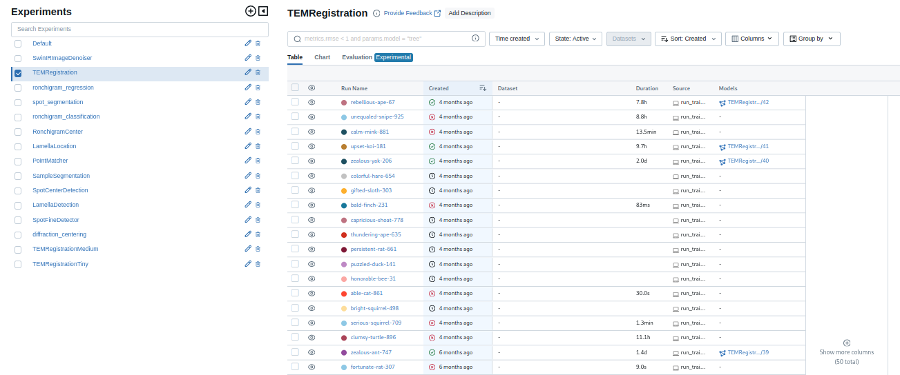
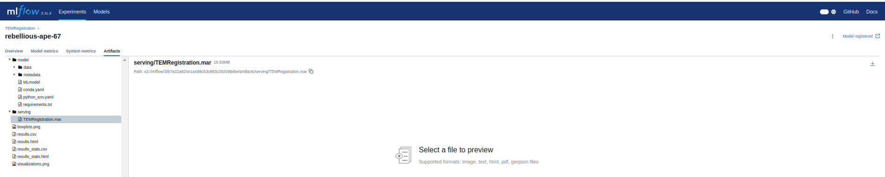

# How to setup custom model
  1. All models should be available on the MLFlow page. If you are creating your own model, .mar file should be available from training.
  2. Go to [MLFlow](172.19.1.16:5555) page.
   

  3. MLFlow repository contains tabs: experiments and models. Pick either your experiment followed by run picking or a model which has been registered. For registered model, there is a link on the corresponding experiment and run: go to link.
  4. In the run page, go to the bottom and under files to download, pick serving folder. Inside runnable .mar file should be located. Download it.
  

  5. Establish remote connection to the microscope.
  6. Open explorer.exe on remote desktop, and on the sidebar on the bottom Linux icon shortcut is shown. Open it and go to DISTRIBUTION_NAME/home/stem/models. **Copy your .mar file there.** DISTRIBUTION_NAME is usually Ubuntu-22.04.
  7. Open terminal app. Open Ubuntu shell by clicking on the down-arrow icon and choosing the corresponding distribution.
  8. Write: ```docker stats```. Copy image name containing torchserve. It should be something like: `torchserve-torchserve-1`
  9. Run `docker restart TORCHSERVE_DOCKER_NAME`
  10. Make sure your model is running by writing: ```curl http://127.0.0.1:8081/models```. Your model should be listed.


# How to modify and upgrade Dockerfile
**ONLY FOR ADVANCED USERS**
If you want to upgrade Dockerfile with a newer version of pytorch or different BASE image on a microscope do the following:
  1. Connect to the remote desktop.
  2. Open terminal app and Open Ubuntu shell by clicking on the left-arrow icon.
  3. Write: ```cd docker```.
  4. Inside docker write nano Dockerfile. In the dockerfile edit what you need for pytorch specify version or index-url.
  5. Exit editing by clickyng **CTRL+X**, **Y**, **Y**.
  6. ```docker build -f Dockerfile -t stem_torchserve```.
  7. ```docker compose down```.
  8. ```docker compose up -d```.

Your torchserve docker should be updated.