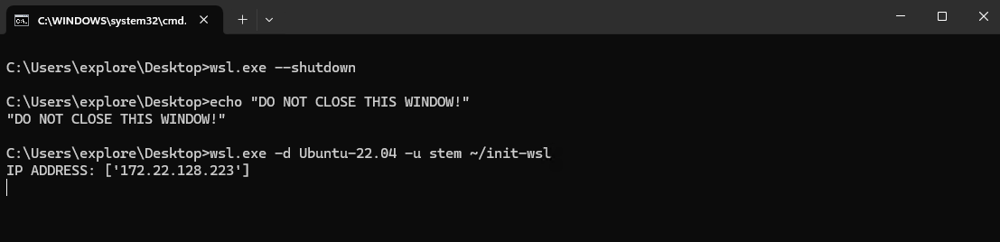
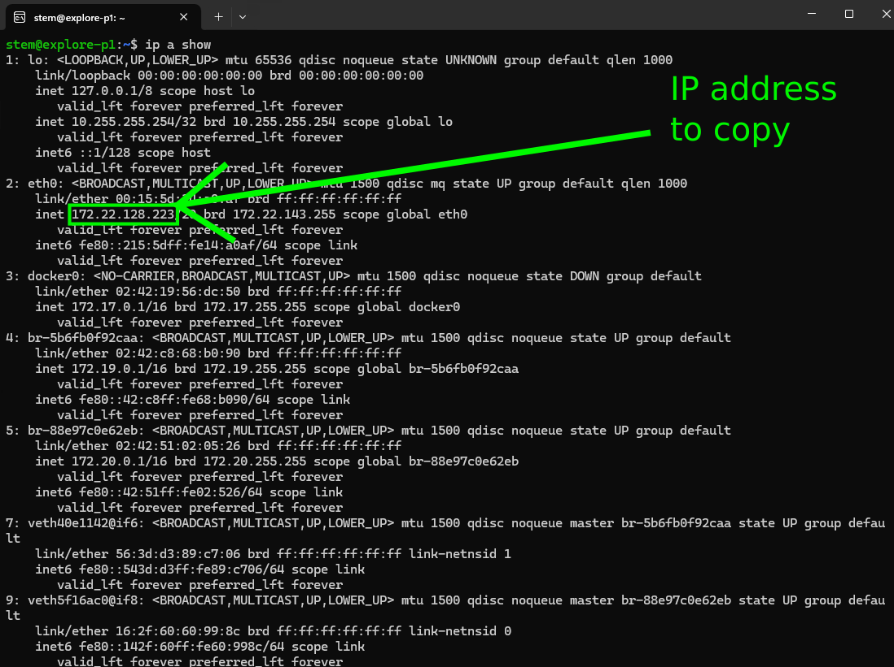
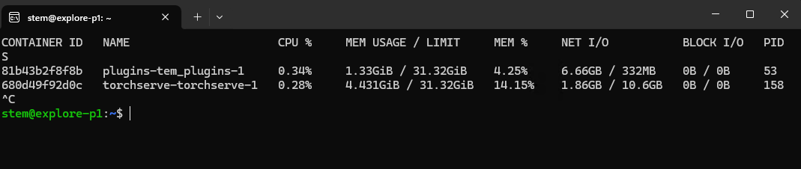

# Update instructions for all services

Update process is made in a offline manner. There is no need for internet connection.
**This tutorial applies to all systems after first installation.**

Get the latest version of these files from google drive links. Download them to *Downloads* folder.

1. dockers.zip
2. tem_plugins.tar
3. stem_torchserve.tar

Move all files to Ubuntu folder. (To access it from Windows Explorer, look for Ubuntu icon on the left side panel, click it and navigate to /home/stem/ or /home/explore/ folder)

- copy all downloaded files into this folder
- unzip dockers.zip
- `docker load -i stem_torchserve.tar`
- `docker load -i tem_plugins.tar`
- If everything went well, feel free to remove `stem_torchserve.tar` and `tem_plugins.tar`.
- Go to `dockers/tem_plugins/` folder and edit .env file using notepad/notepad++ or any other text editor.
- Fill HOST, TORCHSERVE_HOST and if you want data logging on set **SAVE_DATA=1**. Otherwise set **SAVE_DATA=0**.
- To find HOST for the computer, either look onto terminal window with WSL running:
  

  Or type `ip a show` into ubuntu terminal and directly copy IP address.
  

Download and deploy latest version of all models (.mar files) from google drive links.
- unzip models folder.
- put desired models into `C:\Tescan\ml_models\`. Overwrite existing models.
- run `ml_startup.bat` on the **Desktop**.

Check everything is on and working:
- `docker stats` into Ubuntu terminal window should contain these running docker images
  

- `http://HOST:5000/docs` should be alive