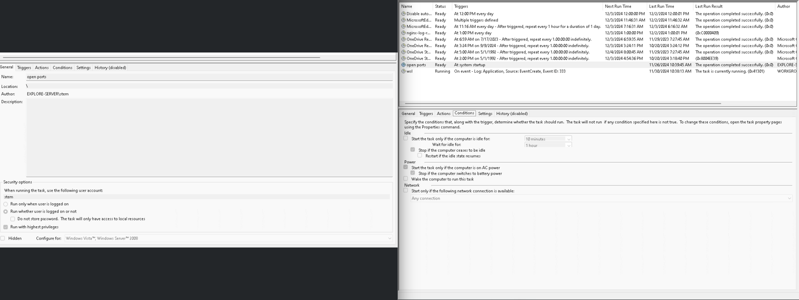

# Initial installation instructions

### Please use preferrably Chocolatey to update all services and skip this tutorial.

1. Install WSL2 on the computer according to https://pureinfotech.com/install-windows-subsystem-linux-2-windows-10/
2. Pick an user, use ```stem``` as username and KNOWN_PASSWORD as password.
3. For more smooth experience install **Terminal** (Microsoft publisher) from Windows Store app.
4. Update and upgrade the system:
   ```
   sudo apt update && sudo apt upgrade
   ```
5. Install systemd, docker.
   ```
   sudo apt install docker.io systemd docker-compose-v2
   ```
6. Allow automatic systemd run by adding the following snippet into */etc/wsl.conf*. Use *sudo nano /etc/wsl.conf* to open and edit the file:
   ```
   [boot]
   systemd=true
   ```
7. Restart WSL by entering *wsl --shutdown* into powershell. Start new ubuntu terminal session.
8. Enable docker and add user to docker group:
   ```
   sudo systemctl enable docker
   sudo usermod -aG docker $USER
   ```
9. restart WSL again and enter *docker stats*. You should see all running docker containers.
10. Install nvidia docker support from https://docs.nvidia.com/datacenter/cloud-native/container-toolkit/install-guide.html. This involves the following snippet:
    ```
    distribution=$(. /etc/os-release;echo $ID$VERSION_ID) \
      && curl -fsSL https://nvidia.github.io/libnvidia-container/gpgkey | sudo gpg --dearmor -o /usr/share/keyrings/nvidia-container-toolkit-keyring.gpg \
      && curl -s -L https://nvidia.github.io/libnvidia-container/$distribution/libnvidia-container.list | \
            sed 's#deb https://#deb [signed-by=/usr/share/keyrings/nvidia-container-toolkit-keyring.gpg] https://#g' | \
            sudo tee /etc/apt/sources.list.d/nvidia-container-toolkit.list
    sudo apt-get update
    sudo apt-get install -y nvidia-docker2
    sudo systemctl restart docker
    sudo docker run --rm --gpus all nvidia/cuda:11.6.2-base-ubuntu20.04 nvidia-smi
    ```
    At the end you should see similar window:
    ```
    Fri Jan 27 07:44:03 2023
    +-----------------------------------------------------------------------------+
    | NVIDIA-SMI 525.85.05    Driver Version: 528.24       CUDA Version: 12.0     |
    |-------------------------------+----------------------+----------------------+
    | GPU  Name        Persistence-M| Bus-Id        Disp.A | Volatile Uncorr. ECC |
    | Fan  Temp  Perf  Pwr:Usage/Cap|         Memory-Usage | GPU-Util  Compute M. |
    |                               |                      |               MIG M. |
    |===============================+======================+======================|
    |   0  NVIDIA GeForce ...  On   | 00000000:01:00.0 Off |                  N/A |
    |  0%   38C    P8    15W / 215W |    246MiB /  8192MiB |      8%      Default |
    |                               |                      |                  N/A |
    +-------------------------------+----------------------+----------------------+

    +-----------------------------------------------------------------------------+
    | Processes:                                                                  |
    |  GPU   GI   CI        PID   Type   Process name                  GPU Memory |
    |        ID   ID                                                   Usage      |
    |=============================================================================|
    |    0   N/A  N/A        24      G   /Xwayland                       N/A      |
    +-----------------------------------------------------------------------------+
    ```

11. Open TaskScheduler in Windows. Create a task that will run ```C:\Tescan\ML\tem_dockers\install\startup.ps1``` script at every startup. See the image for task settings.

1.   Install make: ```sudo apt install make```
2.   Continue with [UPDATE instructions](UPDATE.md).