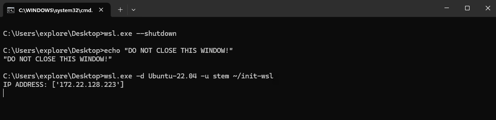
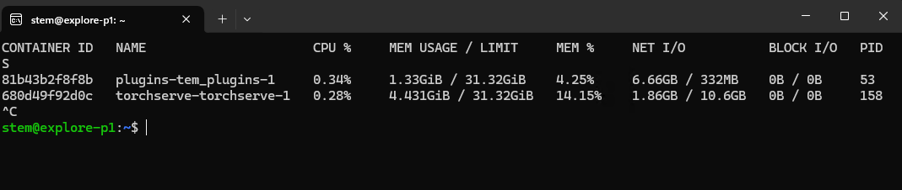

# Update instructions for all services

### Please use preferrably Chocolatey to update all services and skip this tutorial.

Update process is made in a offline manner. There is no need for internet connection.
**This tutorial applies to all systems after first installation.**

Get the latest version of these files from google drive links. Download them to *Downloads* folder.

1. tem_dockers.zip
2. tem_plugins.tar
3. stem_torchserve.tar
4. models.zip
5. tem_plugins_assets.zip (Optional for now)
6. ML-availability.exe - Optional check application for all services. It is standalone application that checks if all services are running.

Move all files to "C:\Tescan\ML" folder.

- copy all downloaded files into this folder
- unzip tem_dockers.zip. Makefile should have this path: C:\Tescan\ML\tem_dockers\Makefile.
- (Optional) unzip tem_plugins_assets.zip into C:\Tescan\ML\tem_plugins_assets.
- unzip models.zip into models folder. New versions of torchserve will load all models from the folder
  and scale models that each computer needs automatically. No need to manually filter models.
- (Optional) Go to `tem_dockers/` folder and edit .env files in `tem_plugins` and `torchserve` folders using notepad/notepad++ or any other text editor.
  If you want data logging on set **SAVE_DATA=1** in .env files. Otherwise set **SAVE_DATA=0**.
- To find IP_ADDRESS of the computer, which is needed to Explore setup, either look onto terminal window with WSL running:
  

 Or use ML-availability.exe, which shows it on startup.

- Run: `make deploy_torchserve` and `make deploy_plugins` from tem_dockers folder.
- If everything went well, feel free to remove `stem_torchserve.tar` and `tem_plugins.tar`.

### Check everything is on and working:
- `docker stats` into Ubuntu terminal window should contain these running docker images
  

- **Use ML-availability.exe to check if all services are running, their status and versions.**
