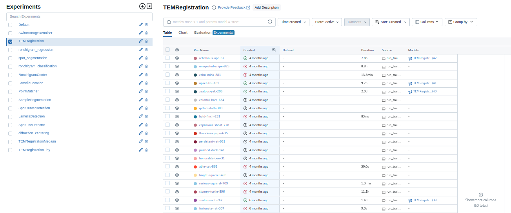
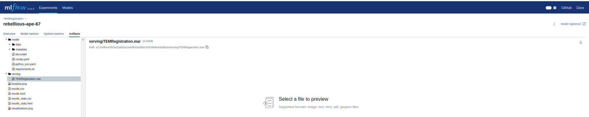

# How to setup custom model
  1. All models should be available on the MLFlow page. If you are creating your own model, .mar file should be available from training.
  2. Go to [MLFlow](172.19.1.16:5555) page.
   

  3. MLFlow repository contains tabs: experiments and models. Pick either your experiment followed by run picking or a model which has been registered. For registered model, there is a link on the corresponding experiment and run: go to link.
  4. In the run page, go to the bottom and under files to download, pick serving folder. Inside runnable .mar file should be located. Download it.
  

  5. Establish remote connection to the microscope.
  6. Put your .mar file into C:\Tescan\ML\models folder.
  7. Restart ML suite.
  8. Check if your model is running by writing: ```curl http://127.0.0.1:8081/models```. Your model should be listed.
  9. Alternatively you can use ML-availability.exe to check if all services are running. YOu can list your model and even scale workers to work with it.
  10. To remove the model, just delete the .mar file from C:\Tescan\ML\models folder and restart ML suite. Again use ML-availability.exe to check if the model is removed.